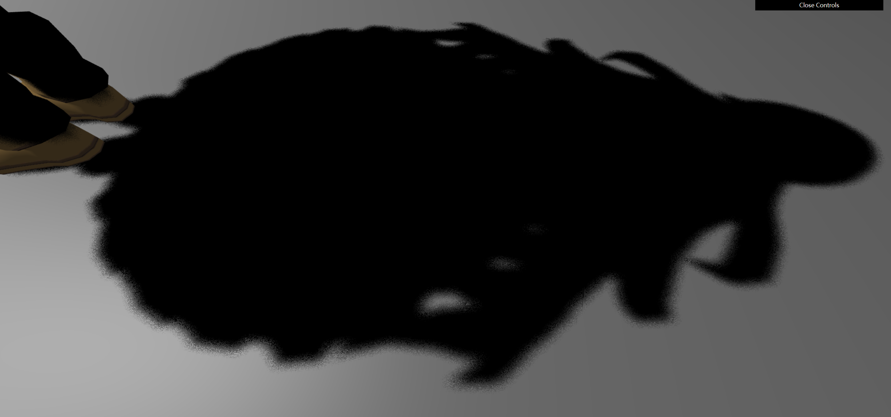

# GAMES101

## SETUP

1. Confirm `GenProj4VS2022.bat`

2. Run `vendor/premake/premake5.exe` to generate the solution file for visual studio 2022.

---

## LABS

### LAB1

Hard Shadow
| ShadowMap Size | Shadows |
| --- | --- |
| 256  |  |
| 1024 | |
| 2048 | |

PCF with `ShadowMap Size = 2048 * 2048`

| Filter Size | Shadows |
| --- | --- |
| 5  |  |
| 10 | |
| 20 | |

| Sample Num | Shadows |
| --- | --- |
| 50  |  |
| 100 | |
| 200 | |

PCSS with `ShadowMap Size = 2048 * 2048`, `Sample Num = 200` and `Filter Size = 20`

---
